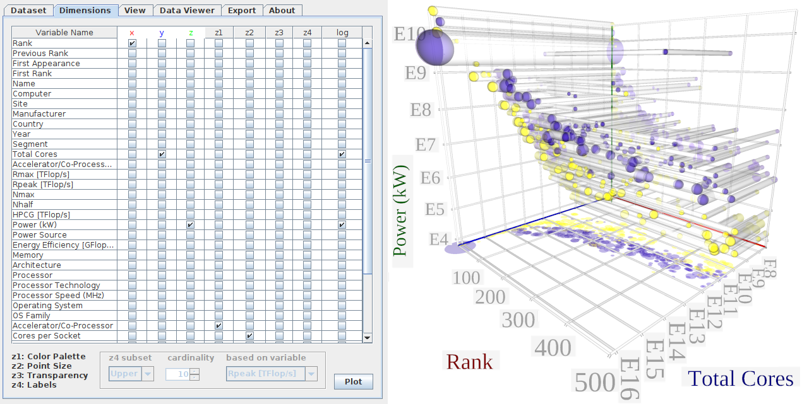
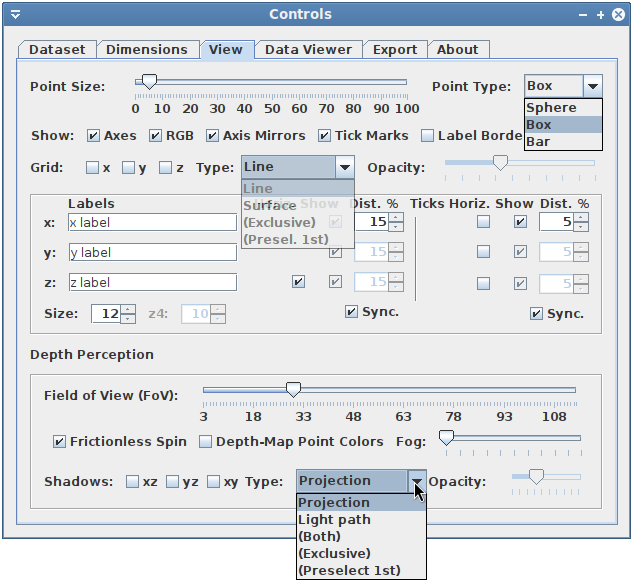
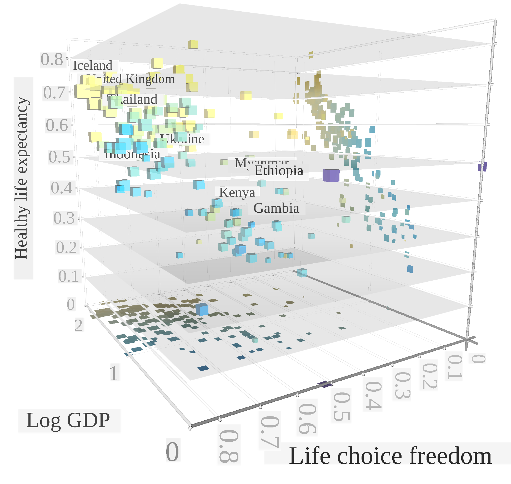
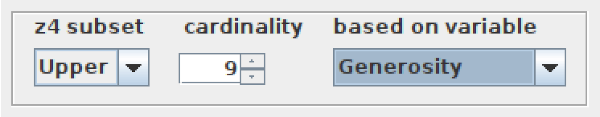

<!---->

# Juniper manual

This document goes over the features of Juniper based on its interface, and presents an additional example plot demonstrating some of the features.

## Multiple-dimensions

The main feature of the software is the ability to effectively represent multi-dimensional data. Apart from the 3 dimensions from the Cartesian coordinate system (*x*, *y* and *z*), the software also supports *colour mapping*, *point size*, *point transparency* and *label overlay* (namely *z1* to *z4* respectively). These additional dimensions are naturally supported in a one-to-many relationship between the available variables (column names) from tabular data. 

Whenever the data of a dimension are not of a double data type, a dictionary is automatically built to represent unique strings with a number, starting with 0 for the first occurrence. Whenever applicable, the corresponding string appears in each tick mark as opposed to its unique identifier for the first occurrence in the dictionary. This extends the applicability of the framework, such as to still be able to place person IDs on the axes or points from anonymised medical data. This functionality is absent from common plotting frameworks such as Gnuplot and GNU Octave, as the programmer has to hard-code the tick associations with strings for every axis when desired. 

Illustratively, the figure below (elaborated in the paper) shows how columns from a dataset can be assigned to any of the available dimensions in the same way as it is done for *x*, *y* and *z*.

The column labels from the dataset are transposed (becoming rows) and used here as rows of checkboxes to facilitate the assignment selection by the user. The column "Variable name" contains the names of the original columns in the dataset. *x*, *y* and *z* represent the corresponding axes, but are also colour-coded to ease intuitiveness. %The dimensions *z1*, *z2* and *z3* are expressed on the point transparency, size and colour mapping respectively. 
In existing plotting software the logarithmic scale is usually associated with an axis, but here there is a checkbox for each dimension to enable a quick and interactive exploration of multi-dimensional datasets. 

This arrangement totals 7 dimensions, and the function of columns to dimensions is one-to-many. For instance, the colour-mapping can be applied to the same values as the *z*-axis, which is commonly done to represent surface depth in existing designs. This may be done to emphasise a specific axis. Note that the framework also provides the functionality to directly map the point colours to distances from the camera, to improve the depth perception of the figure overall (see below).

## Depth perception and point readability

The figure below shows the expanded options from the *View* tab in the control window, mostly relating to visual cues (for depth perception and point readability). This section goes over the view-related features with the help of this screenshot.

One of the highlights of the presented software is the focus on depth perception. At the bottom of the *View* tab a layered pane includes the depth-perception-related visual cues, as elaborated below.

- *Field-of-View (FoV)*: exaggerating the FoV may improve the readability of 3D scatterplots, such as by influencing the point geometry as seen by the camera (observer). The value starts from a value of 3 to avoid some JavaFX-related artifacts from overlapping surfaces. 

- *Depth-based colour mapping*: this feature replaces the colour map dimension (*z1*) with the values from calculating the distance of each point to the camera. The colour palette is *viridis*, which aims at readability [[1]](#1). The corresponding variation in the colour of each point is also applied on their projection, and this is expected to help with associating arbitrary points to their projections.

- *Fog*: similar to the above, fog is designed to help with depth perception in the same way as weather visibility, which is also measured in distance units. See the example figure below for a subtle fog effect.

- *Projections and light paths*: projections are just two-dimensional projections on the surfaces of the view box. They inherit the colour mapping and shape of the points (e.g. circles for spheres), and there is the option to enable them in the *xz*, *yz* and *xy* panes (2-select combinations of the axes). The light paths connect the projection perimeters to the actual points, similar to the umbra in shadows in the real world. The opacity of those "shadows" is controlled by the opacity slider, also to help with adjusting visibility in denser datasets. Projection and light path examples can be seen in [this](images/5dfig_top500.png) figure.

- *Grid options*: the framework supports two types of grids. First is the line, which is more conventional. Second is the grid surfaces, which can be seen as semi-transparent 3D equivalents of the grid lines, also corresponding to the tics. The grid surface is demonstrated in the example below:

- *Frictionless spin*: this checkbox, when selected, it leaves the yew rotation speed steady after a modification with the cursor. The effect is an infinite animation.

The "type" combobox for the latter two dictates the functionality of the *x*, *y* and *z*, or *xz*, *yz* and *xy* checkboxes. In the shadow case, "projection" only enables the corresponding protections, as with "light path" for light paths, and "both" synchronises the appearance of both per axis. "exclusive" falls back to "projection", but enables a light path where a projection is available, and "preselect" operates as "light path" while enabling all projections. The idea behind the exclusive is that the information of both types of shadows is redundant, but the other options exist such as when a crowded plot is in consideration. Similarly for the grid case, it is used to select between line or surfaces, with the general idea to compact most-likely useful functionality in the GUI.

The following table summarises secondary customisation options:

| Component | Ranges | Description | Other notes |
| --------- | ------ | ----------- | ----------- |
|Frictionless spin|{true, false}|steady yaw rotation after cursor modification|infinite animation effect, relating to depth perception|
|Point size | 0 to 100% | sizing of the points and the corresponding shadows | also effective whenpoint size is data-dependant |
|Point type | {box, sphere, bar} | selecting a point shape | can affect FoV perception |
|Axis options | {true, false} *4 | show axes, mirrors (view box edges) and tickmarks | also, "RGB" refers to the axis colour-coding |
|Opacity | {0 to 100%} * 2 | adjust opacity, (influences visibility in denser data) | one is for all grid types, the  other is for all shadow types |
|Label text | (string) * 3 | setting the x, y and zaxis labels | pre-loaded with column names, when available |
|Label/tick distance | {-100 to 100%}* 3*2 | relative distance from thecorresponding axis bar | 6 spinners for 3 axes times 2 for the labels and tick marks |
| Label/tick show | {true, false}* 3*2 | enabling the labels |  as above |
| Horizontal | {true, false} * 3*2 | rotating the corresponding labels by multiples of 90 degrees | yaw can automatically adjust increments to face the center |
|Synchronise | {true, false} * 2 | freeze y and z label/tick  options and mirror x values | simplifies controls |
|Borders | {true, false} | drawing a grey border around each label/ tick | aiming at legibility |
|Label size | {1 to 100} * 2 | label font size | one for label and ticks, one  for the labels of *z4* dimension|

## World happiness report example

Another interesting and timely dataset is the world happiness report for 2024, as served by Kaggle [[2]](#2). The idea behind this dataset is to use easily obtainable variables to calculate a ladder score; a research-informed model for happiness [[3]](#3). 

*Multiple factors of world happiness. Point size is the happiness. The label filter facility (top) is used to decide which countries to annotate.*

This has additional visual cues for depth perception (a field of view of 70 degrees, slight fog, and depth-mapped point colouring). The axes dimensions are the variables *health life expectancy*, *freedom to make life choices*, the logarithm of *GDP per capita* (as given in the dataset). The 4th dimension is the point size, which represents the ladder happiness score. As can be seen by the 2 projections in the corresponding surfaces, there is a clear correlation between the *x*, *y* and *z* variables, before talking about the happiness index. The *health life expectancy* is linearly related to the *Log GDP per capita*, as seen from the linear trend in the projections of the right surface. In the other take-2 combinations of the 3 axes, we see a more clustered representation towards the high-end, where the points are also larger. This means that they need to co-exist to contribute to happiness, but are related less directly.

The 5th dimension is the country names, and is here partly represented by labels as a discrete dataset. Below is an overlaid screenshot from the control panel on the 6th dimension (*perceived generosity*) with which the label subset is based on. 

In this example, the top 9 countries based on the *generosity* variable are denoted with labels. As an observation, there is some correlation of happiness with *generosity*, but is much less influential than the other indicators. For instance, the points of Ethiopia and Kenya are in the top few with regard to generosity, but their medium size and central positioning demonstrates weaknesses in the other happiness indicators and the overall happiness score.

## References

<a id="1">[1]</a> Rocchini, D., Nowosad, J., D'Introno, R., Chieffallo, L., Bacaro, G., Gatti, R.C., Foody, G.M., Furrer, R., Gábor, L. and Lovei, G.L., 2022. Scientific maps should reach everyone: a straightforward approach to let colour blind people visualise spatial patterns.

<a id="2">[2]</a>  Kaggle (jaina), “World Happiness Report - 2024,” [Accessed
06/2024]. [Online]. Available: [kaggle.com/datasets/jainaru/
world-happiness-report-2024-yearly-updated](https://kaggle.com/datasets/jainaru/
world-happiness-report-2024-yearly-updated)

<a id="3">[3]</a>  J. Helliwell, R. Layard, J. Sachs, J. De Neve, L. Aknin, and S. Wang,
“World happiness report 2024. university of oxford, wellbeing research
centre,” 2024.

