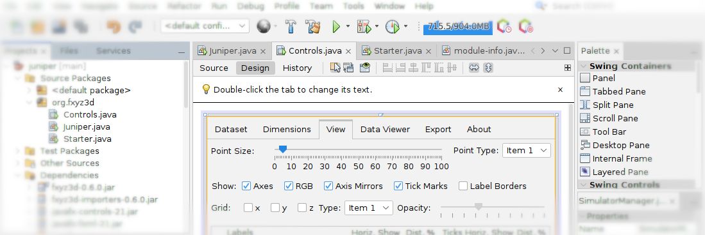

# Juniper

Juniper is a JavaFX-based Plotting Framework for Effective Multi-Dimensional 3D Scatterplots.


## Steps to run

1. Clone this repository with git:
	```
	$ git clone https://philippos.info/repo/philippos/juniper
	```

1. Install Oracle [JDK](https://www.oracle.com/java/technologies/downloads/) or [OpenJDK](https://openjdk.org/) and Apache [Maven](https://maven.apache.org/install.html). These are also usually available in common software repositories.

1. Run the following in a Linux, Windows or Mac terminal within the juniper directory:

	```
	$ mvn javafx:run
	```
	
1. Use the GUI to generate plots. A sample dataset is provided and can be loaded directly ("TOP500_202406_co.csv" from top500.org, explained in the paper).

See the [``MANUAL.md``](MANUAL.md) for more details on its functionality.


### Troubleshooting

Use the following workarounds for common issues:

- If there is an environment issue relating to the platform, it needs to be specified accordingly (win, mac, or linux), e.g. run with:

	```
	$ mvn javafx:run -Djavafx.platform=linux
	```

- If Maven complains that "release version 21 is not supported", then this is an indication that you have installed the Java runtime environment (JRK), instead of the Java Development Kit (JDK). For example, in a fresh Ubuntu release (tested with 24.04 LTS, 25.04) machine, only the following is required to be able to run all aforementioned commands:

	```
	$ sudo apt install git openjdk-21-jdk maven
	```

## Development

Most of the development is done is inside two Java files: [``Juniper.java``](src/main/java/org/fxyz3d/Juniper.java) and [``Controls.java``](src/main/java/org/fxyz3d/Controls.java).

The source of Juniper can be edited using any editor, but the recommended IDE is [Apache NetBeans](https://netbeans.apache.org/). This directory contains the required files to be able to be opened as a NetBeans project. NetBeans IDE has originally been used to generate the GUI-related code within ``Controls.java``. That part of the code is automatically locked (grayed-out) within NetBeans, to be able to maintain the interface from NetBean's GUI builder (Form Editor).



The generated API documentation (Javadocs) can be opened with ``target/reports/apidocs/index.html`` using a browser after having the repository locally. Note that due to the GUI elements and FXyz file structure, it may be more straightforward to also see the inline comments in the code for detailed implementation insights.


## Citing

For the moment, you can cite this repository directly or an [Arxiv pre-print](https://arxiv.org/abs/2406.06146v2). Note that the plan is to split the latter into two separate papers, one for this framework, and another one for the empirical study from Trinity College Dublin.


## License

Copyright (C) 2025  Philippos Papaphilippou

The project's source code is licensed under the GNU Affero General Public License 3.0 (see [LICENSE](LICENSE)).


